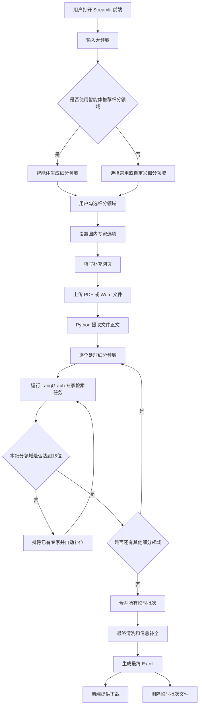
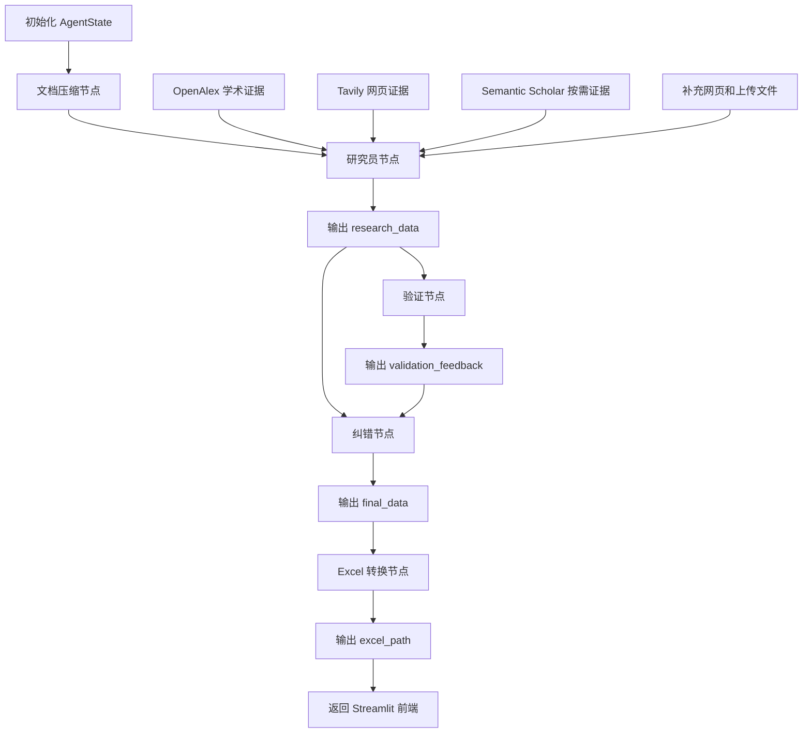
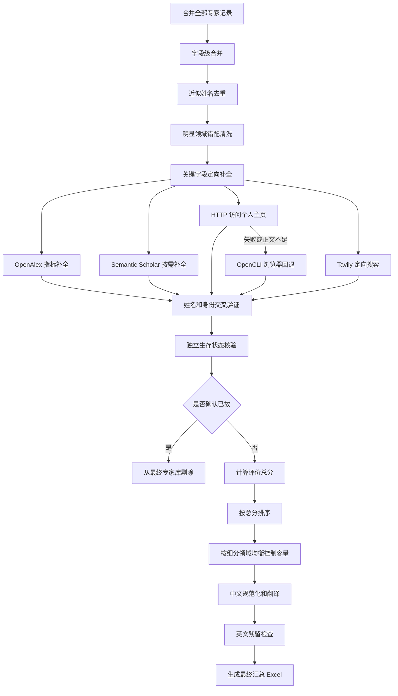

本文件使用语雀兼容的基础 Mermaid 语法，将完整系统拆分为三张纵向流程图，避免图形过宽或渲染接口返回 Bad Request。

## 一、系统总体流程

## 二、单次 LangGraph 任务流程

## 三、最终清洗与交付流程

## 四、关键状态字段

| 节点 | 读取字段 | 输出字段 |
| --- | --- | --- |
| 文档压缩节点 | supplemental_document_context | compressed_supplemental_document_context |
| 研究员节点 | query、排除名单、目标人数、压缩文档 | research_data |
| 验证节点 | research_data | validation_feedback |
| 纠错节点 | research_data、validation_feedback | final_data |
| Excel 转换节点 | final_data | excel_path |

## 五、架构说明

- 外部工具不是由 LLM 自主调用，而是 Python 先调用 OpenAlex、Tavily、Semantic Scholar、主页访问和 OpenCLI，再将证据交给 LLM 整理。
- 每个细分领域独立维护专家排除名单，当前目标为最多 15 位专家。
- 不同细分领域可以出现同一位专家，最终合并时保留其多个真实细分领域归属。
- 中间批次文件写入系统临时目录，`Expert_Results` 只保留最终汇总结果。
- 明显领域错配、确认已故、身份错配和近似重复记录会在最终交付前清洗。
- 单个外部服务失败时记录日志并降级，不中断整个检索流程。
